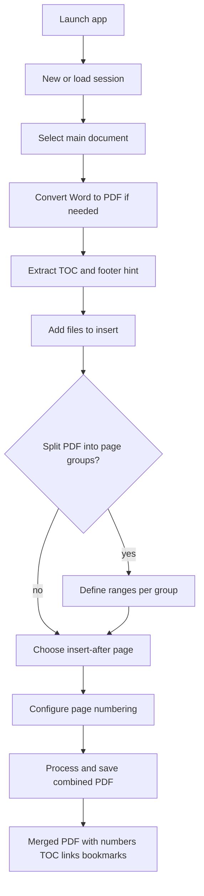
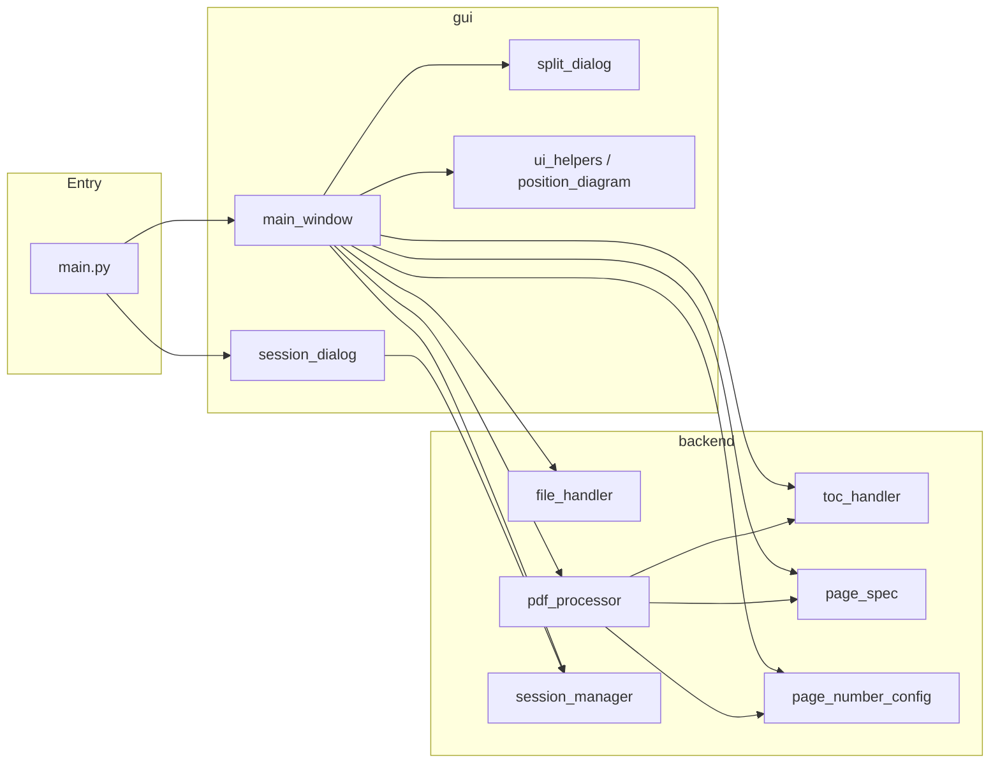

# The Reportinator

Desktop tool for assembling multi-part reports into a single PDF with consistent page numbering, optional table-of-contents updates, and hierarchical PDF bookmarks.

Typical use: start from a main Word/PDF body, insert appendices or chapter PDFs at chosen page boundaries, then stamp page numbers and refresh TOC links in one pass.

---

## Features

- **Main + inserts assembly** — pick a main document, then insert other PDF/Word files after specific pages
- **Page-range splits** — split one PDF into groups (e.g. `1-4`, `5,6,7`) and insert each group at a different location
- **Word → PDF** — converts `.doc` / `.docx` via Microsoft Word (Windows COM) before merging
- **Flexible page numbers** — labels, chapter prefixes, digit padding, fonts, colours, relative or absolute position, white background option
- **Table of contents** — extracts TOC from the main document; updates visible TOC page numbers when possible; rebuilds outline bookmarks to match post-insertion pages
- **Sessions** — save/load work-in-progress (files, insert points, numbering options) under `~/The Reportinator`

---

## Requirements

| Requirement | Notes |
|-------------|--------|
| Windows | Word COM conversion uses `pywin32` |
| Python 3.10+ | Developed/tested with a local venv |
| Microsoft Word | Needed only when converting `.doc` / `.docx` |

Python packages (see [`requirements.txt`](requirements.txt)):

```
PyQt6, PyPDF2, python-docx, reportlab, pywin32, pdfplumber, pikepdf
```

---

## Quick start

```bash
git clone <repository-url>
cd PageNumberingTool

python -m venv .venv
.\.venv\Scripts\activate
pip install -r requirements.txt

python main.py
```

On first launch, choose **Start new session** or open a previously saved session JSON.

### Build a standalone `.exe` (optional)

```bash
python exe_builder.py
```

Produces `TheReportinator.exe` on the Desktop (PyInstaller onefile, no console). Bundles `fonts.json` and uses `PageNumber.ico`.

---

## Typical workflow



1. **Session** — start fresh or resume a saved session.
2. **Main document** — select the body (Word or PDF). The app converts Word once, caches the PDF, reads page count, extracts TOC, and samples footer position for numbering hints.
3. **Insertions** — add PDFs/Word files. For each segment, choose *where* it goes (after a TOC chapter or a custom page number). Use **Split?** to place different page ranges of the same file at different locations.
4. **Page numbering** — set label, prefix, digits, font, colour, and position (presets or custom % / cm from a chosen corner).
5. **Process** — pick an output path. The pipeline converts remaining Word files, merges the main document with insertions, updates TOC page numbers when possible, stamps page numbers (preserving links), and rebuilds PDF bookmarks from the TOC hierarchy.
6. **Save session** (anytime) — stores paths, insert specs, and numbering options for later.

---

## System architecture

The project is split into a thin entry point, a **GUI** package, and a **backend** package. The UI never manipulates PDF bytes directly; it orchestrates backend services.



### Package layout

```
PageNumberingTool/
├── main.py                 # App entry; stdio guard for PyInstaller
├── exe_builder.py          # Windows executable build
├── fonts.json              # Font list for the numbering UI
├── PageNumber.ico
├── requirements.txt
├── backend/                # Domain / PDF logic (no Qt)
│   ├── file_handler.py     # Extension checks, path helpers
│   ├── page_number_config.py
│   ├── page_spec.py        # Page ranges, InsertionSegment, split groups
│   ├── pdf_processor.py    # Convert, merge, stamp numbers
│   ├── session_manager.py  # Session JSON under ~/The Reportinator
│   └── toc_handler.py      # TOC extract, overlay, bookmarks
└── gui/                    # PyQt6 presentation
    ├── main_window.py      # Main UI and orchestration
    ├── session_dialog.py
    ├── split_dialog.py
    ├── position_diagram.py
    └── ui_helpers.py
```

### Backend responsibilities

| Module | Role |
|--------|------|
| `file_handler` | Validate supported paths (`.pdf`, `.docx`, `.doc`) |
| `page_spec` | Parse page specs (`1-4`, `5,6,7`), split groups, `InsertionSegment` model |
| `page_number_config` | Presets, formatting, origins, load `fonts.json` |
| `pdf_processor` | Word→PDF (COM), page counts, extract/merge pages, stamp numbers with ReportLab/pikepdf |
| `toc_handler` | Detect TOC pages/entries, adjust page numbers after insertions, overlay updated numbers, apply outline bookmarks |
| `session_manager` | Save/load session JSON; name files as `YYMMDD_user_document.json` |

### GUI responsibilities

| Module | Role |
|--------|------|
| `session_dialog` | Startup: new session vs open existing |
| `main_window` | File table, numbering form, TOC preview, process action |
| `split_dialog` | Multi-line page-group editor for one insert file |
| `position_diagram` | Live preview of number position on a page thumbnail |
| `ui_helpers` | Shared form layout helpers |

### Processing pipeline (backend)

When **Process** runs, `PDFProcessor.process_files_with_main` does roughly:

1. Resolve each Word path to a PDF (cache / convert).
2. For each insertion, extract the selected page subset if needed.
3. Merge: main PDF with inserts spliced after the chosen pages.
4. If TOC can be updated in place, rewrite visible TOC page numbers for the new layout.
5. Stamp page numbers onto every page while preserving existing links.
6. Rebuild the PDF outline from TOC entries with page numbers adjusted for insertions.

---

## Sessions

Sessions are JSON files in:

```
%USERPROFILE%\The Reportinator\
```

They store the main path, insertion segments (path, pages spec, insert-after), and page-numbering options so you can pause and resume large report builds.

---

## Supported inputs

| Format | Behaviour |
|--------|-----------|
| `.pdf` | Used directly |
| `.docx` / `.doc` | Converted with Word via COM, then treated as PDF |

Output is always a single combined `.pdf`.

---

## Notes and limitations

- **Windows + Word** are required for Word conversion; PDF-only workflows do not need Word open for every step, but conversion does.
- TOC **visible** number updates succeed only when anchors can be matched reliably; otherwise chapter **bookmarks/links** are still applied where possible, and a note is shown after processing.
- Page numbering positions assume common page sizes (UI helpers use A4 cm for absolute mode); verify critical layouts on a sample export.
